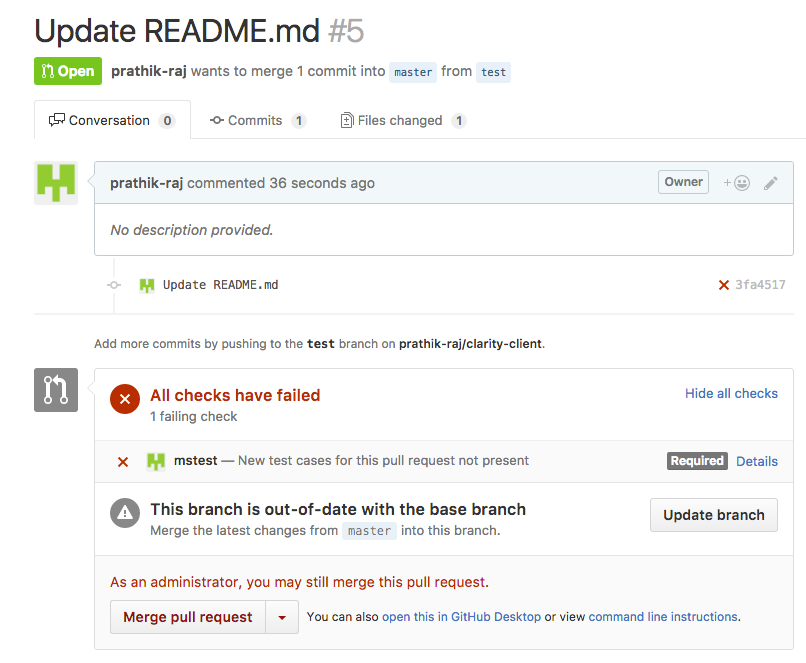

[](https://travis-ci.org/prathik/microQ) [](https://coveralls.io/github/prathik/microQ?branch=master)

microQ is a Github service that sees if a particular pull request has test cases associated with it.

# Why?

When you have systems like Jenkins or Travis that can automatically pull the Git repo and run tests when a commit
is pushed what is the need for a system like this?

The reason is simple, microQ focuses on REST based integration tests only. If you are using Travis or Jenkins you'll
have to write code to make the HTTP calls and test whether the response matches some expected response. This would
include code to store your test cases somewhere, read that code and then make the http calls and finally check the
response. microQ does all that for you. All you have to do is create your test cases and expected responses, give the
hostname to which the call needs to be made and the remaining things are taken care of.

In the future releases we will also add the ability to pass javascript functions to validate the given response.

You will love it!

# How it works?

When ever a pull request is raised, edited, a check is made to the service to see if there are any test cases associated
with the pull request and if it is not present then the pull request is marked as invalid. If tests are
present against a pull request then it is marked as good.

# How to create a test?

```shell
curl -X POST \
  http://<host>/tc/clarity-client/ \
  -H 'content-type: application/json' \
  -d '{
        "name": "randomTest",
        "httpMethod": "GET",
        "expectedResponse": null,
        "host": "<testing-host>",
        "user": "prathik.raj",
        "service": "clarity-client",
        "pullRequest": 0,
        "body": "aggga"
    }'
```

In the above case `clarity-client` is the service name. Service name is the same as your repository name.

# Example

Test case not present


